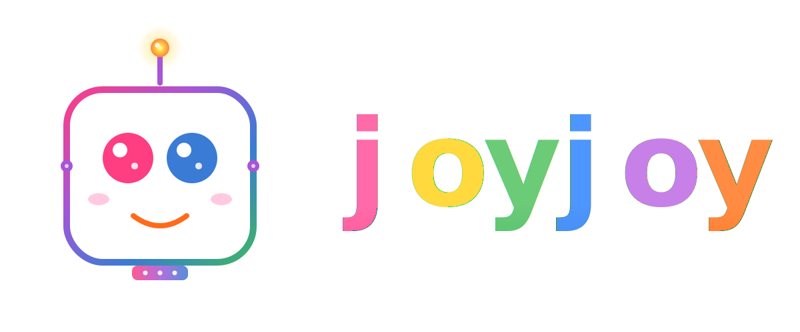
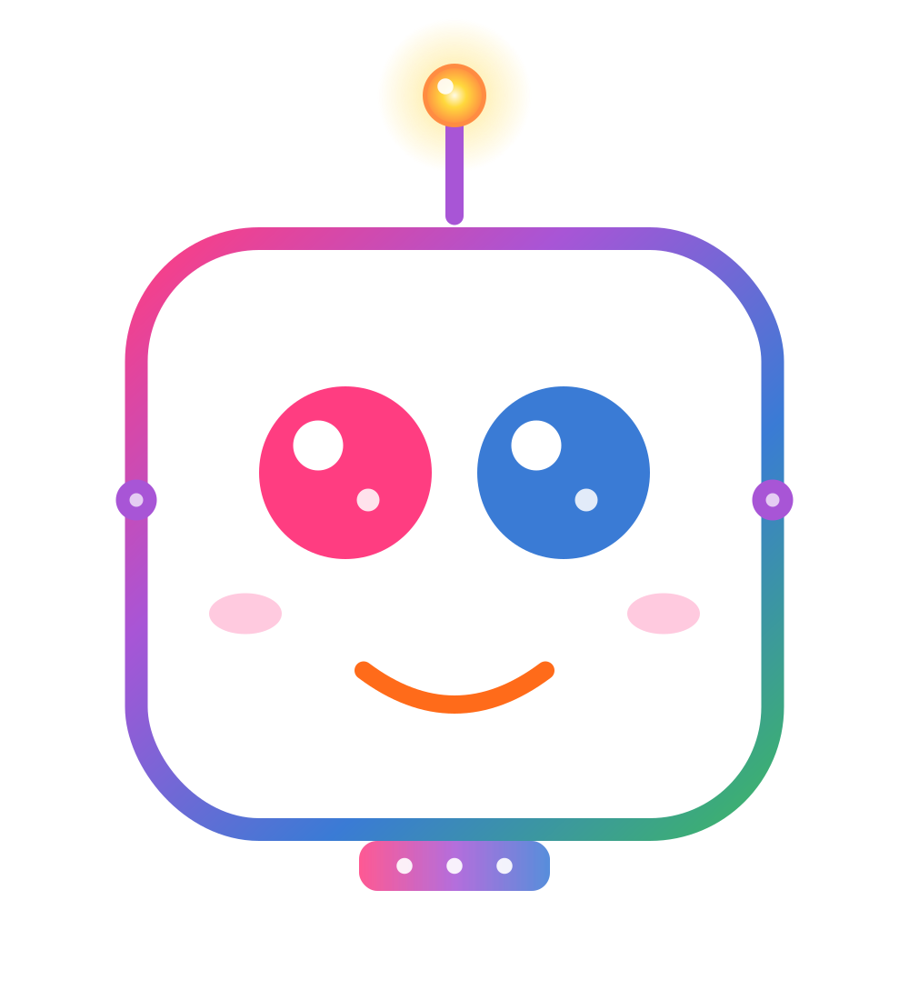

<p align="center">
  <picture>
    <source media="(prefers-color-scheme: dark)" srcset="svg/joyjoy-dark.svg">
    
  </picture>
</p>

<h1 align="center">joyjoy — Brand Kit & Design System</h1>

<p align="center">
  <em>The official logo, color, and usage guide for <a href="https://github.com/gourangasatapathyvit/joyjoy">joyjoy</a> — a multi-tenant Deep Agents backend.</em>
</p>

<p align="center">
  
  
  
</p>

---

## Table of contents

- [1. What's in this folder](#1-whats-in-this-folder)
- [2. The mascot](#2-the-mascot)
- [3. Logo system — when to use which](#3-logo-system--when-to-use-which)
- [4. Color palette](#4-color-palette)
- [5. Typography](#5-typography)
- [6. Spacing & clear-space](#6-spacing--clear-space)
- [7. Do's & don'ts](#7-dos--donts)
- [8. Drop-in usage snippets](#8-drop-in-usage-snippets)
- [9. Rebuilding assets from SVG](#9-rebuilding-assets-from-svg)
- [10. License](#10-license)

---

## 1. What's in this folder

```
joyjoy-brand-kit/
├── README.md                     ← you are here
├── svg/                          ← source vectors (edit these)
│   ├── joyjoy-primary.svg        mascot + wordmark             (hero / lockup)
│   ├── joyjoy-mark.svg           mascot only, transparent      (avatar / loading)
│   ├── joyjoy-icon.svg           rounded square w/ gradient bg (app icon)
│   ├── joyjoy-favicon.svg        simplified mascot             (browser tab)
│   ├── joyjoy-mono.svg           single-color (currentColor)   (themed/print)
│   └── joyjoy-dark.svg           dark-mode hero lockup         (dark UIs)
├── png/                          ← rendered raster (don't edit; regenerate)
│   ├── joyjoy-primary.png        1800×… (hero, README, slides)
│   ├── joyjoy-mark.png           1000×… (transparent avatar)
│   ├── joyjoy-icon-512.png       512×512 (Docker Hub, OG)
│   ├── joyjoy-icon-1024.png      1024×1024 (App Store-tier)
│   ├── joyjoy-mono.png           800×…  (mono fallback)
│   └── joyjoy-dark.png           1800×… (dark-mode hero)
├── favicon/                      ← browser & OS tab icons
│   ├── favicon.ico               multi-res 16/32/48/64/128/256
│   ├── joyjoy-favicon-32.png
│   ├── joyjoy-favicon-64.png
│   ├── joyjoy-favicon-128.png
│   └── joyjoy-favicon-256.png    (use as apple-touch-icon)
├── preview/
│   └── contact-sheet.png         every variant at a glance
└── scripts/
    └── build-assets.py           regenerate all PNGs from SVGs
```

> **Rule of thumb:** the **SVGs in `svg/` are the source of truth.** PNGs in `png/` and `favicon/` are generated from them — never edit a PNG by hand. Regenerate via [§9](#9-rebuilding-assets-from-svg).

---

## 2. The mascot

The joyjoy mascot is a **friendly square robot** with:

| Element | Meaning | Color |
|---|---|---|
| Two big eyes (pink + blue) | The two `j`s in **joyjoy** — and a nod to multi-tenant ("alice" + "bob") | `#FF3D81` & `#3A7BD5` |
| Yellow LED on a purple antenna | The agent is "thinking" / actively reasoning | `#FFD93D` glow on `#A855D6` stem |
| Rainbow gradient head outline | The full joyjoy spectrum, contained | pink → purple → blue → green |
| Curved orange smile | Approachable, joyful (it's literally in the name) | `#FF6B1A` |
| Cheek blush | Personality — keeps the bot from feeling cold | `#FFB8D4` |
| Side bolts (two purple dots) | Subtle "I'm a robot" cue without being heavy-handed | `#A855D6` |
| Chest panel with 3 LEDs | Status row — running, healthy, ready | gradient bar |

**Personality tone:** friendly · curious · helpful · never sarcastic. Think Pixar robot, not Terminator.

---

## 3. Logo system — when to use which

| Variant | File | Use it for | Min width |
|---|---|---|---|
| **Primary** | `svg/joyjoy-primary.svg` | README header, app headers, docs nav, slides, marketing site hero | 240 px |
| **Mark only** | `svg/joyjoy-mark.svg` | Avatars, loading spinners, chat bubble "thinking", merch | 64 px |
| **App icon** | `svg/joyjoy-icon.svg` + `png/joyjoy-icon-1024.png` | GitHub social preview, Docker Hub avatar, OG image | 256 px |
| **Favicon** | `svg/joyjoy-favicon.svg` + `favicon/favicon.ico` | Browser tab, PWA manifest, mobile bookmark | 16 px |
| **Monochrome** | `svg/joyjoy-mono.svg` | Print, fax, terminal screenshots, single-color emboss | 128 px |
| **Dark mode** | `svg/joyjoy-dark.svg` | Dark-themed READMEs (via `<picture>`), dark webui header | 240 px |

### Picking the right one — flowchart

```
 Are you on a dark background?
        │
        ├── yes ──► joyjoy-dark.svg
        │
        └── no ──► Do you have room for the wordmark?
                        │
                        ├── yes ──► joyjoy-primary.svg
                        │
                        └── no ──► Tiny size (<64px)?
                                        │
                                        ├── yes ──► joyjoy-favicon.svg
                                        │
                                        └── no ──► joyjoy-mark.svg
```

---

## 4. Color palette

### Primary brand colors

| Token | Hex | RGB | Use |
|---|---|---|---|
|  `joy-pink` | `#FF3D81` | `255, 61, 129` | Left eye, pink **j** in wordmark, accents |
|  `joy-blue` | `#3A7BD5` | `58, 123, 213` | Right eye, blue **j** in wordmark, links |
|  `joy-yellow` | `#FFD93D` | `255, 217, 61` | Antenna LED, "thinking" indicator |
|  `joy-orange` | `#FF6B1A` | `255, 107, 26` | Smile, warning/active states |
|  `joy-purple` | `#A855D6` | `168, 85, 214` | Antenna stem, side bolts |
|  `joy-green` | `#3DB665` | `61, 182, 101` | Success states, healthy status LED |

### Gradient stops (the rainbow border)

```css
--head-border: linear-gradient(135deg,
  #FF3D81 0%,
  #A855D6 33%,
  #3A7BD5 66%,
  #3DB665 100%
);
```

### Neutrals

| Token | Hex | Use |
|---|---|---|
|  `surface-light` | `#FFFFFF` | Light backgrounds, head fill |
|  `surface-dark` | `#0F1117` | Dark mode background |
|  `surface-dark-elevated` | `#1A1D26` | Dark mode card / head fill |
|  `text-strong` | `#3A4151` | Tagline / heading text |
|  `text-muted` | `#6B7280` | Subcopy / metadata |
|  `divider` | `#C9CFD9` | Hairlines, separators |

### CSS variables — copy-paste

```css
:root {
  --joy-pink:   #FF3D81;
  --joy-blue:   #3A7BD5;
  --joy-yellow: #FFD93D;
  --joy-orange: #FF6B1A;
  --joy-purple: #A855D6;
  --joy-green:  #3DB665;

  --joy-pink-soft:   #FF6BA8;
  --joy-blue-soft:   #4D96FF;
  --joy-purple-soft: #C780E8;
  --joy-orange-soft: #FF8C42;
  --joy-yellow-soft: #FFB627;
  --joy-green-soft:  #6BCB77;

  --joy-surface:        #FFFFFF;
  --joy-surface-dark:   #0F1117;
  --joy-surface-dark-2: #1A1D26;
  --joy-text:           #3A4151;
  --joy-text-muted:     #6B7280;
  --joy-divider:        #C9CFD9;

  --joy-rainbow: linear-gradient(135deg,
    var(--joy-pink) 0%,
    var(--joy-purple) 33%,
    var(--joy-blue) 66%,
    var(--joy-green) 100%);
}
```

---

## 5. Typography

### Wordmark
The "joyjoy" wordmark uses a **bubbly rounded sans-serif** with weight `900`. Fallback stack:

```css
font-family: 'Comic Sans MS', 'Baloo 2', 'Quicksand', 'Trebuchet MS', sans-serif;
font-weight: 900;
```

> **Note:** the wordmark in the SVGs is **rendered live from system fonts**. If you need pixel-perfect fidelity across all platforms, export the wordmark to outlined paths in your design tool, or commit to bundling a webfont (recommended: [Baloo 2](https://fonts.google.com/specimen/Baloo+2) — free, OFL).

### UI text (body, captions)

```css
font-family: 'Inter', 'Segoe UI', 'SF Pro Text', Arial, sans-serif;
```

- **Headings:** Inter 600–700
- **Body:** Inter 400
- **Code / IDs:** `'JetBrains Mono', 'Fira Code', 'Consolas', monospace`

---

## 6. Spacing & clear-space

Keep a clear-space margin around the logo equal to **the height of one "o"** in the wordmark.

```
                  ╔═══ clear space ═══╗
       ┌──────────╫───────────────────╫──────────┐
       │          ║                   ║          │
       │   ╔═══╗  ║   ╔═══════════╗   ║  ╔═══╗   │
       │   ║ o ║  ║   ║   LOGO    ║   ║  ║ o ║   │   ← clear space
       │   ╚═══╝  ║   ╚═══════════╝   ║  ╚═══╝   │      = 1× "o" height
       │          ║                   ║          │
       └──────────╫───────────────────╫──────────┘
                  ╚═══════════════════╝
```

### Minimum sizes

| Variant | Minimum on-screen | Minimum in print |
|---|---|---|
| Primary (mascot + wordmark) | 240 px wide | 35 mm wide |
| Mark only | 32 px square | 8 mm square |
| Favicon | 16 px square | n/a |

Below these sizes, switch to the next-smaller variant.

---

## 7. Do's & don'ts

### ✅ Do

- Use the SVG whenever possible — it scales perfectly.
- Use the `<picture>` element to swap `joyjoy-primary` ↔ `joyjoy-dark` based on color scheme.
- Place the logo on **white**, **#0F1117 dark**, or the **gradient background** from the app icon.
- Keep at least 1× "o"-height of clear space around it.
- Use the monochrome version on photos or when only one ink is allowed.

### ❌ Don't

- ❌ Stretch the logo non-proportionally
- ❌ Recolor individual letters or eyes — the per-letter gradient is part of the identity
- ❌ Add drop shadows, glows, or strokes on top of the existing SVG
- ❌ Place it on busy photos without a backing plate
- ❌ Re-typeset "joyjoy" in a different font — always use the SVG wordmark
- ❌ Rotate the logo or skew it
- ❌ Use the favicon-simplified mascot at sizes > 128 px (use `joyjoy-mark.svg` instead)
- ❌ Crop the antenna — it's part of the silhouette

---

## 8. Drop-in usage snippets

### README header (light + dark swap)

```markdown
<p align="center">
  <picture>
    <source media="(prefers-color-scheme: dark)"
            srcset="docs/branding/svg/joyjoy-dark.svg">
    
  </picture>
</p>
```

### HTML `<head>` (webui)

```html
<!-- Modern browsers prefer SVG; ICO fallback for old ones -->
<link rel="icon" type="image/svg+xml" href="/static/joyjoy-favicon.svg">
<link rel="icon" type="image/x-icon"  href="/static/favicon.ico">
<link rel="apple-touch-icon" sizes="180x180"
      href="/static/joyjoy-favicon-256.png">

<!-- PWA / OG -->
<meta name="theme-color" content="#FF3D81">
<meta property="og:image" content="/static/joyjoy-icon-1024.png">
<meta property="og:image:width" content="1024">
<meta property="og:image:height" content="1024">
```

### React / JSX inline mark

```jsx
import JoyjoyMark from './assets/joyjoy-mark.svg?react';

export function Avatar({ thinking }) {
  return (
    <div className={`avatar ${thinking ? 'pulse' : ''}`}>
      <JoyjoyMark width={40} height={44} />
    </div>
  );
}
```

### CSS — "thinking" pulse for the LED

```css
.joyjoy-led {
  animation: joyjoy-pulse 1.4s ease-in-out infinite;
  transform-origin: center;
}
@keyframes joyjoy-pulse {
  0%, 100% { filter: drop-shadow(0 0 4px var(--joy-yellow)); }
  50%      { filter: drop-shadow(0 0 14px var(--joy-yellow)); transform: scale(1.08); }
}
```

### GitHub social preview

Upload `png/joyjoy-icon-1024.png` (or a custom 1280×640 made from it) under
**Repository → Settings → Social preview**.

### Terminal banner (for `start_all.sh`)

```bash
cat <<'BANNER'
       .---.
      ( o.o )       j o y j o y
       |‿‿‿|       ─────────────
       '---'        deep agents backend
BANNER
```

---

## 9. Rebuilding assets from SVG

All PNGs are generated from the SVGs in `svg/`. To rebuild after editing:

### Prerequisites

```bash
pip install cairosvg pillow
```

### Build script

A ready-to-run script lives at `scripts/build-assets.py`. Run it from the brand-kit root:

```bash
python scripts/build-assets.py
```

It will regenerate every PNG in `png/` and `favicon/`, plus the multi-resolution `favicon.ico`.

### What you should edit vs. regenerate

| Want to change… | Edit | Then run |
|---|---|---|
| A color | `svg/*.svg` (`<linearGradient>` stops) | `build-assets.py` |
| The wordmark size or spacing | `svg/joyjoy-primary.svg` `<text>` blocks | `build-assets.py` |
| Add a new size | Add a JOB row to `scripts/build-assets.py` | `build-assets.py` |
| Drop the antenna for an icon variant | Duplicate `svg/joyjoy-icon.svg` → edit | `build-assets.py` |

---

## 10. License

Brand assets © 2026 Gouranga Satapathy / joyjoy project. The mascot, wordmark, and color system are part of the joyjoy project identity and follow the repository's license at the root.

- ✅ **You may** use these assets to refer to joyjoy in articles, talks, tutorials, integrations, and merchandise made for the joyjoy community.
- ❌ **You may not** modify the mascot to imply official endorsement of a different product, sell the assets standalone, or use the wordmark in a way that suggests joyjoy is yours.

When in doubt, open an issue at **[github.com/gourangasatapathyvit/joyjoy](https://github.com/gourangasatapathyvit/joyjoy)**.

---

<p align="center">
  
  <br>
  <sub>Made with 💜 for the joyjoy project</sub>
</p>
